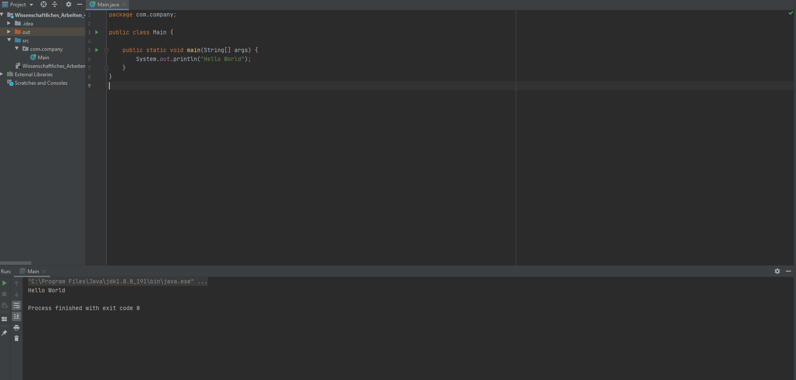

# Wissenschaftliches_Arbeiten_4
To run this program, copy the repository link with the github clone function.
Using you prefered IDE, for example IntelliJ, open version control and select Clone under Git and enter the link there.
Now the program should be imported into your local IDE.
To run it, simply run the Main.java method under src/com/company/Main.java.

